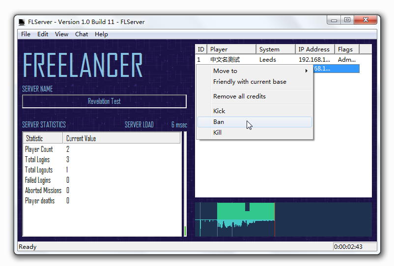

Revelation Mod FLHook Plugin
=====================================

This is a plugin made for make mod running.

Features
-------------------------

### Administrator shortcuts widget

When enabled, it will display a control panel on the right side of FLServer main window allowing server administrator to manage online players by simple mouse-click.

### Exposed inner data

The plugin exposes it's own inner data and tool's interfaces such as In-game player data etc allowing programmer build another plugin bases on it more easily.

For example, you want to get where are the faction who running the base, all you have to do now is: 

	wstring factionName = Data::getBase(L"li01_01_base").getFaction()->getName();

And that's all
-------------------------

Public domained source code, serve yourself :P